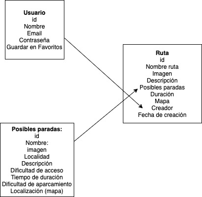

# Rutas v1.0

Proyecto "Rutas" es una App que nos sirve para conocer los diferentes espacios naturales en Extremadura. En ella podemos encontrar los principales museos, monasterios, piscinas naturales... además, podremos guardar en favoritos nuestros lugares preferidos, así como crear aquellos que consideremos esenciales de visitar y que aún no estén creados para que los demás usuarios puedan conocerlos.
 ## Descripción Funcional

Las características principales de la app son las siguientes:

- Visualización las diferentes zonas turísticas de Extremadura.

- Visualización de los principales espacios naturales, museos y otros lugares en Extremadura.

- Registro de lugares de favoritos.

### Casos de uso

Aquí añadimos nuestro diagramas de casos de uso, con su actor y las elipses que simbolizan los casos:

## Descripción Técnica
-  Para crear validaciones: lo que hacemos es llamar a la función dentro del endpoint donde queremos validar. Para ello, en el fichero "validations" creamos una variable donde crearemos las diferentes funciones con los errores correspondientes. Exportamos el module y lo requerimos en el fichero que lo vayamos a utilizar.
Usamos esto para que nos de el error de forma síncrona y así no tener que entrar al servidor.

- 
 ## Tecnologías

 - HTML
 - CSS (Bootstrap)
 - Vanilla JS

 ## Versiones
- V.1.0
 

 ## TO-DO

  - Modificar partes de lugar creado

  - 

  